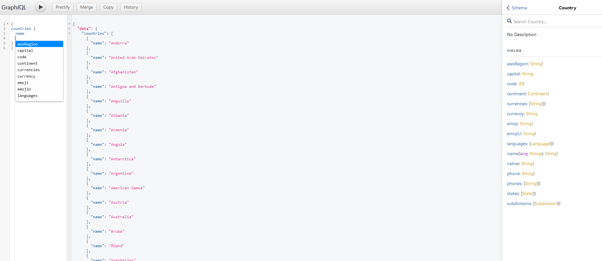

# GraphiQL Interface Generator

This tool serves as a proof of concept, aimed at producing GraphiQL interfaces by utilizing introspection.
It's currently only set up for local usage, as there is no intention of hosting this anywhere.

## Start'em Up
`npm install && npm start`

## Why?
I noticed sometime ago that Prismic repository names and access tokens can frequently be spotted in developer tools. Upon investigating, I concluded that this is essential, in many cases, for the Prismic Preview feature to operate
(maybe this is the reason Pisrmic only offers a Read API?). 

I wanted to do something with this, so my goal was to devise a method to easily access the Prismic endpoint using this information.
While Prismic's official documentation heavily promotes using their client for data queries, it offers little guidance on querying via the fetch method... so I kind of just had to figure that out on my own.

Even the official Prismic website exposes this information:

## Exploring Prismic Repositories
For demonstration purposes, I will use a different repository as we are submitting a large introspection query.

Subsequently, you'll be able to view and query the entirety of the repository:

## General GraphQL Endpoints
I extended this approach to cater to standard GraphQL endpoints as well. For publicly accessible endpoints, providing the URL should suffice.
For endpoints that require authentication, there's also an option to include an Authorization header.

I got this GraphQL endpoint from [this](https://github.com/graphql-kit/graphql-apis) Github repository.
The Authorization header displayed below is purely illustrative and isn't necessary for this specific example.

The results are consistent with the above method:

## Final notes
This tool is not perfect, it makes a lot of assumptions so it would probably not work for all cases.
I tried it for several different Prismic repositories and GraphQL endpoints and it worked fine, but I would need more test cases to further improve upon this tool.
